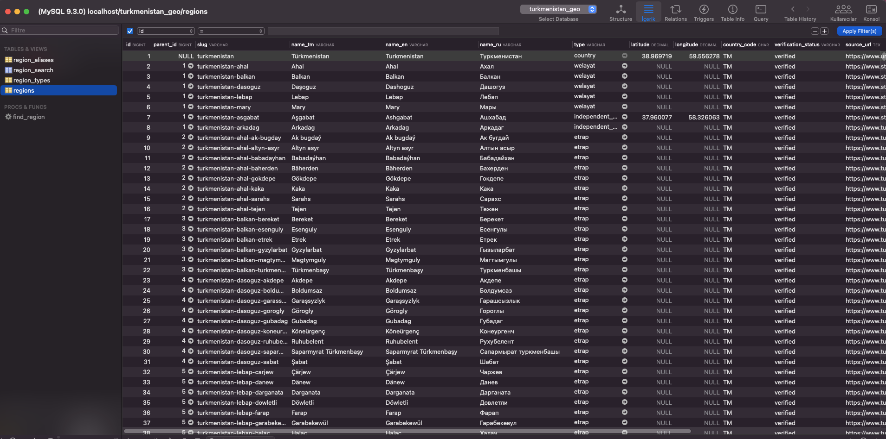
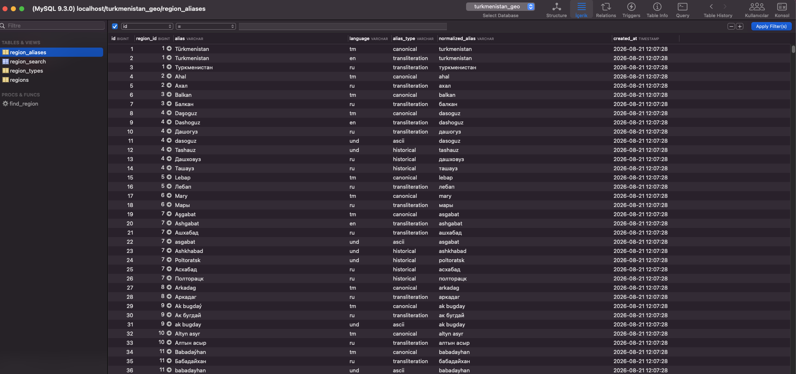
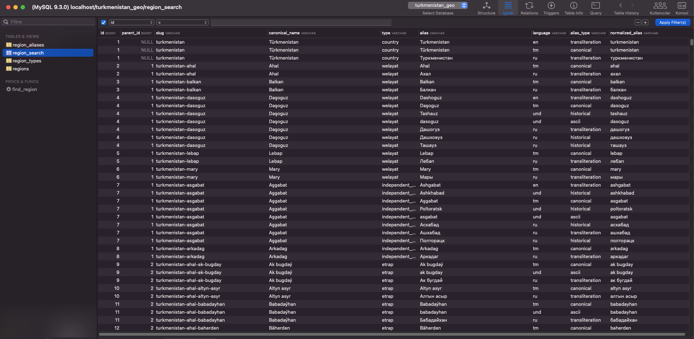

# tm-data
<<<<<<< HEAD
SQL datasets for Turkmenistan’s administrative regions and settlements.
=======

Ready-to-import SQL datasets for the administrative geography and settlements of Turkmenistan.

Supports PostgreSQL, MySQL, SQLite, and SQL Server. Each database is provided as a standalone `import.sql` file containing the schema, indexes, search helpers, and seed data.

## Choose a language

| Language | Instructions | Sources |
| --- | --- | --- |
| 🇬🇧 English | [English import guide](source/en/README.md) | [English sources](source/en/SOURCES.md) |
| 🇹🇲 Türkmençe | [Türkmençe import gollanmasy](source/tm/README.md) | [Türkmençe çeşmeler](source/tm/SOURCES.md) |

## Download

Choose your database and use its `import.sql` file:

| Database | Import file |
| --- | --- |
| PostgreSQL 14+ | [`sql/postgresql/import.sql`](sql/postgresql/import.sql) |
| MySQL 8+ | [`sql/mysql/import.sql`](sql/mysql/import.sql) |
| SQLite 3.24+ | [`sql/sqlite/import.sql`](sql/sqlite/import.sql) |
| SQL Server 2017+ | [`sql/sqlserver/import.sql`](sql/sqlserver/import.sql) |

Each file includes:

- Database schema
- Administrative region data
- Region aliases
- Indexes
- Search helpers
- Seed data

Imports are idempotent and can be safely run again without creating duplicate regions or aliases.

## Preview

<table>
  <tr>
    <td align="center">
       
      <b>Regions</b>
    </td>
    <td align="center">
       
      <b>Region Aliases</b>
    </td>
    <td align="center">
       
      <b>Region Search</b>
    </td>
  </tr>
</table>
>>>>>>> 7900f75 (Initial release)
