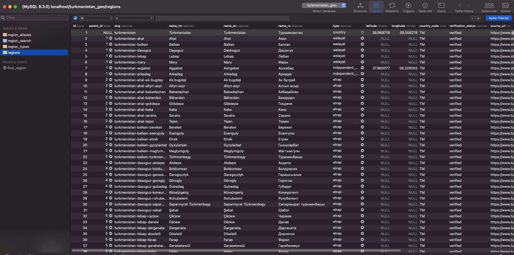
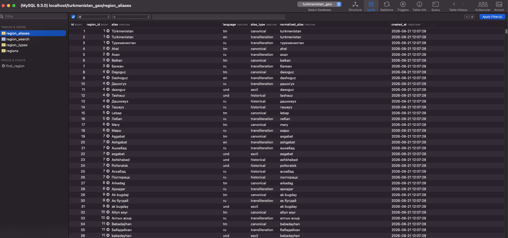
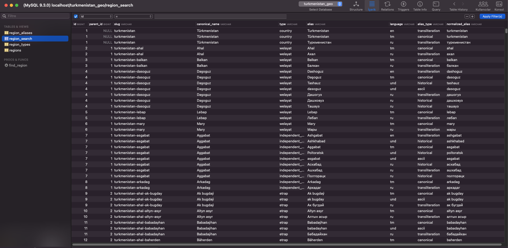

# geo

Ready-to-import SQL and GeoJSON datasets for the administrative geography and settlements of Turkmenistan.

Supports PostgreSQL, MySQL, SQLite, and SQL Server. Each database is provided as a standalone `import.sql` file containing the schema, indexes, search helpers, and seed data.

## Choose a language

| Language | Instructions | Sources |
| --- | --- | --- |
| 🇬🇧 English | [English import guide](source/en/README.md) | [English sources](source/en/SOURCES.md) |
| 🇹🇲 Türkmençe | [Türkmençe import gollanmasy](source/tm/README.md) | [Türkmençe çeşmeler](source/tm/SOURCES.md) |

## Download

Choose your database and use its `import.sql` file:

| Database | Import file |
| --- | --- |
| PostgreSQL 14+ | [`sql/postgresql/import.sql`](sql/postgresql/import.sql) |
| MySQL 8+ | [`sql/mysql/import.sql`](sql/mysql/import.sql) |
| SQLite 3.24+ | [`sql/sqlite/import.sql`](sql/sqlite/import.sql) |
| SQL Server 2017+ | [`sql/sqlserver/import.sql`](sql/sqlserver/import.sql) |
| GeoJSON (RFC 7946) | [`geojson/regions.geojson`](geojson/regions.geojson) |

Each file includes:

- Database schema
- Administrative region data
- Region aliases
- Indexes
- Search helpers
- Seed data

Imports are idempotent and can be safely run again without creating duplicate regions or aliases.

## GeoJSON

`regions.geojson` is a UTF-8 `FeatureCollection` generated from the canonical
SQLite import. It contains one feature per region or settlement. Feature IDs
are stable slugs; properties include the parent slug, names, type, verification
status, and record-level source metadata. Records with coordinates use WGS 84
`Point` geometry in `[longitude, latitude]` order. Records without documented
coordinates use `geometry: null`; coordinates and administrative boundary
polygons are never inferred.

Regenerate and check the export from the repository root:

```sh
go run ./tools/geojson
go run ./tools/geojson --check
go test ./tools/geojson
```

The source coverage, dates, licensing, and verification limitations documented
in the [English](source/en/SOURCES.md) and [Turkmen](source/tm/SOURCES.md)
source guides apply unchanged to this derived export.

## Preview

<table>
  <tr>
    <td align="center">
      <br>
      <b>Regions</b>
    </td>
    <td align="center">
      <br>
      <b>Region Aliases</b>
    </td>
    <td align="center">
      <br>
      <b>Region Search</b>
    </td>
  </tr>
</table>
